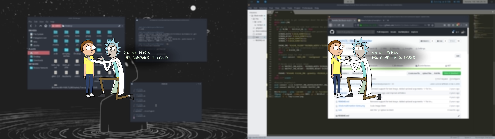

# i3lock-multimonitor | blurred-screenshot+transparent-background

This is a fork of [i3lock-multimonitor](https://github.com/ShikherVerma/i3lock-multimonitor)

This Script takes a PNG with transparent background, scales **only** the transparent background to each of multiple screens, joins the multiple scaled up image and caches it for use. Then, it uses ffmpeg to capture the current screen and overlay a blur upon which the cached image is placed and then i3lock executed with the result.

## Requirements

> i3lock
> ffmpeg
> xrandr
> imagemagick

## Usage

Place clone the repo, replace with background.png your transparent image, run lock.sh